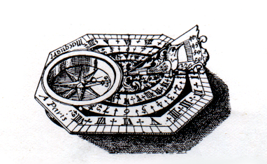

# Butterfield

  

This project aims to be an ongoing implementation of the Roughtime protocol, and
a tool for assisting in validating interoperability, behaviours of both clients
and servers. It's not by the namesake of the protocol, aiming to have high
accuracy or precision with respect to timestamps, however will try its best not
to be deliberately terrible at it either.

Why the name? It's named after
[Butterfield dials](https://en.wikipedia.org/wiki/Butterfield_dial), which were
a type of portable sundial found in France in the late 17th and 18th century.

## Building & Running

If you don't already have a compatible Elixir runtime, there's an included
Dockerfile which is used by the Makefile for building, testing, and debugging.

## Developing

In addition to having some unit tests in the `test/` directory, there are several
tools for code quality included. Running `make test` will only run unit testing,
`make analyse` will perform more thorough checking. There is also documentation
and code formatting steps included.

## License

Copyright 2023- the Butterfield authors.

Licensed under the Apache License, Version 2.0 (the "License"); you may not use
this file except in compliance with the License.  You may obtain a copy of the
License at

   http://www.apache.org/licenses/LICENSE-2.0

Unless required by applicable law or agreed to in writing, software distributed
under the License is distributed on an "AS IS" BASIS, WITHOUT WARRANTIES OR
CONDITIONS OF ANY KIND, either express or implied.  See the License for the
specific language governing permissions and limitations under the License.

